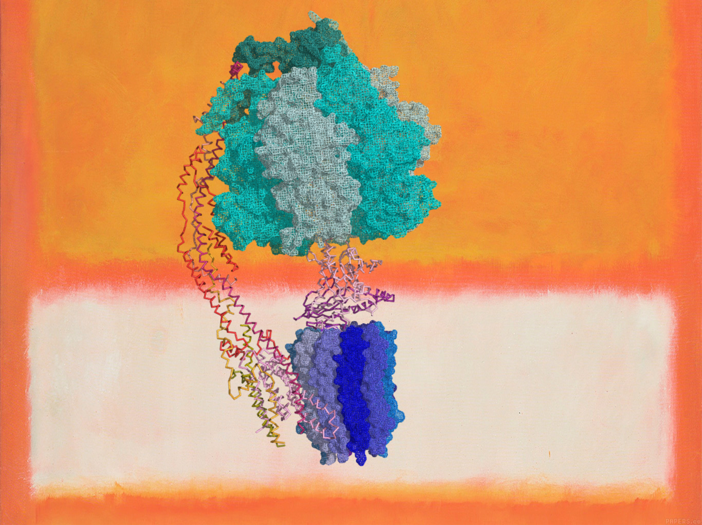

**Hello visitor ! Welcome to scaralbi's webpage.**

## Index
* [Blog](blog.md)
* [Research](research.md)  
* [Resources](resources.md)

## What is this ?
This is just my personal site on the web.
I use it to record thoughts and share information.

> Homo liber nulla de re minus quam de morte
cogitat; et ejus sapientia non mortis sed vitae
meditatio est.  
(There is nothing over which a free man ponders
less than death; his wisdom is, to meditate not on
death but on life.)  
[SPINOZA'S Ethics, Pt IV, Prop.67]  

## Who am I ?
I am a 22 years old human being living in Cambridge, UK.
I am particularly excited about synthetic biology, cyanobacteria, and anything that aims to engineer sustainability in our biosphere.
* [CV]({{ site.url }}/assets/cv.pdf)

## Disclaimer
This website was created under the terms of the open-source MIT license.
Do you want to collaborate in some scientific projects?
Do you want to ask me a question ?
Write to me at as2945@cam.ac.uk.

### 
 Alberto Scarampi©, 2020 

