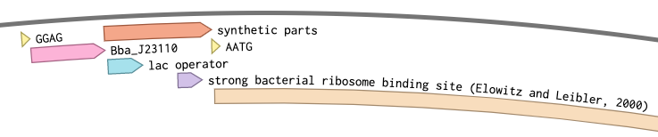
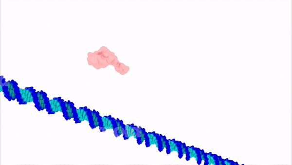
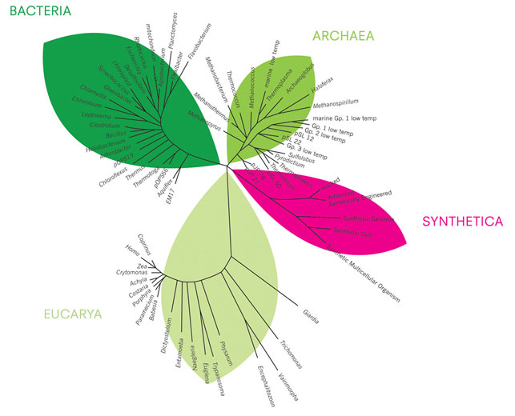
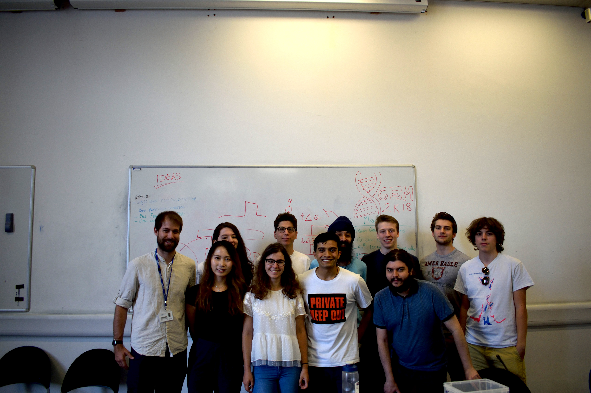

# Research Interest

During my undergraduate degree I developed a passion for [synthetic](https://en.wikipedia.org/wiki/Synthetic_biology) and [systems biology](https://en.wikipedia.org/wiki/Systems_biology): two fields of research that aim to engineer and deconstruct living systems in order to understand their assembly logic. 
I am now trying to apply those principles to study how and why certain bacteria are able to sense and generate electrical signals when living in [biofilms](https://en.wikipedia.org/wiki/Biofilm). 
In particular, I am curious about the molecular mechanisms and genetic components that allow [cyanobacteria](https://en.wikipedia.org/wiki/Cyanobacteria) to produce electricity from sunlight, air and water (in so-called [biophotovoltaic devices](https://en.wikipedia.org/wiki/Biological_photovoltaics)). 
I am also keen about developing biophysical techniques to investigate how the evolution of electrical signalling in structured communities of [exoelecotrogenic](https://en.wikipedia.org/wiki/Exoelectrogen) photosynthetic bacteria contributes to the emergence of collective properties.

## Green Biotechnology
I am fascinated by the reactions of [photosynthesis](https://en.wikipedia.org/wiki/Photosynthesis), which enables photosynthetic organisms to perform the complex chemistry of transforming solar into chemical energy, in ambient conditions and in a self-repairing way. This complex network of reactions can be exploited to catalyse the transition towards a greener future, where biomanufacturing of therapeutics, commodity chemicals and biofuels will take place in photosynthetic organelles.

In particular, cyanobacteria hold great promises as sustainable bioproduction platforms, for their ability of photoproduction of added-value biomass and electricity ([Knoot et al., 2018](https://www.ncbi.nlm.nih.gov/pmc/articles/PMC5892586/); [Wey et al., 2019](https://chemistry-europe.onlinelibrary.wiley.com/doi/full/10.1002/celc.201900997)).
There is a lot of interest in expanding synthetic biology toolkits to engineer cyanobacteria for photobiomanufacturing and energy generation.
However, exploiting cyanobacteria as reliable microfactories requires precise control of gene expression. Current biological control systems fail to provide the reversible and programmable spatiotemporal control of electrical systems used in industry. Electrogenetics is an emerging field of synthetic biology investigating electronic control of gene expression. Whereas electrogenetic control has been demonstrated to enable precise spatial patterning in *E. coli*, currently photosynthetic cells lack an analogous induction system.

## Bio-Photo-Electrochemistry

It is now a widely accepted fact that net decarbonisation of human activities in the soonest future is required to avoid the collapse of our planet into irreversible climate calamities. To this aim, efficient and sustainable ways need to be developed for energy production, which is currently responsible for almost a third of global carbon emissions,
Harnessing the almost limitless supply of solar radiation with photosynthetic organisms using biophotovoltaic  (BPV) devices is a promising strategy in the pursuit of these goals.
BPVs are [bio-electrochemical systems](https://en.wikipedia.org/wiki/Bioelectrochemical_reactor) (BES) that harvest electrons generated from photo-oxidation of water by photosynthetic materials to generate electrical work ([McCormick et al. 2015](https://pubs.rsc.org/en/content/articlelanding/2015/ee/c4ee03875d#!divAbstract)).

As the process is driven by cells performing oxygenic photosynthesis, BPVs offer the possibility of coupling carbon dioxide sequestration and electricity generation, in a self-sustainable way.  
In the last decade, considerable work has been done to optimise the bioelectrochemistry of these systems, which have proven useful to understand the mechanisms of electron transfer in photosynthetic organisms.
However, to date, these devices are not commercially viable and examples of their use outside of the academic world are limited.
We need to encourage discussions about potential applications of biophotovoltaic devices and brainstorm ideas needed to catalyse the scaling-up of solar electricity bioconversion.
Hopefully, in the near future, BPVs will be useful to power for low power demanding, off-grid applications.

## Synthetic Biology
My interest in synthetic biology derives from its potential to design biological processes from the bottom-up.
I am excited by the possibility to combine electronics and synthetic biology to engineer electrogenetic control in synthetic ecosystems and biofactories.

### What is synthetic biology ?
The [Royal Society](https://royalsociety.org/topics-policy/projects/synthetic-biology/) defines Synthetic Biology as "an emerging area of research that can broadly be described as the design and construction of novel artificial biological pathways, organisms or devices, or the redesign of existing natural biological systems."
It is very interdisciplinary: biochemistry, biology, physics, computing, art and many other disciplines are included in synthetic biology.
The idea is that every organism is defined by its DNA, which is like the software of a programme. All the information needed for an organism to operate is written in DNA code (which uses just four symbols: A, C, G, T). Like computer scientists can write various different programs that perform all sort of functions with a programming language, synthetic biologists aim to engineer the organisms by writing in genetic code.
There are various reasons for why we want to do this. The main on, arguably, is for purely heuristic (research, understanding) purposes. This follows the famous [Feynman](https://en.wikipedia.org/wiki/Richard_Feynman) quote "what I cannot create I do not understand". By programming organisms from scratch we hope to understand how they work.
Another reason is to engineer organisms to perform functions that they would not perform naturally. With this approach, we can programme bacteria to identify and kill cancerous cells. Or we can make hydrogen out of algae instead of using nasty chemicals and polluting the environment.
If you want to read more, have a look at these websites:
- [What is synthetic biology - BIO](https://www.bio.org/articles/synthetic-biology-explained)
- [Ginkgo Bioworks website (the Apple of Synthetic Biology)](https://www.ginkgobioworks.com/)
- [iGEM website - crazy synbio projects by undergraduate students](https://igem.org/Main_Page)

Synthetic Biology is a field of research that deconstructs biological systems to understand their assembly logic. 
This reverse engineering of life has been hailed by the scientific community as the field capable of solving most of the challenges that we are going to face in the future, such as overpopulation, pollution and lack of natural resources.
However, the public perception of it does not seem to always follow the optimistic view held by those in the field.
The problem is that biological systems are incredibly  complex, and therefore discussion often requires  technical knowledge, which is becoming increasingly difficult to possess as disciplines become increasingly specialised.
The traditional view of scientists is that they need to be pure and out of the context of social and political debate, with the only responsibility of scientific integrity. 
It should not come as a surprise then if the public perception on matters such as vaccination, OGM, homeopathy and evolution seems to follow emotional beliefs rather than scientific evidence. Tax benefits for the producers of homeopathic and “organic” products, creationism trends and the bad acceptance of OGM products are just some examples of this failure in translating scientific progress into public engagement. If scientists focused on elucidating the complexity of life are not involved in translating it in a more user-friendly manner, then the rise of irrational trends manifested by the general public could be a result of the failure of the scientific community to interact with the rest of the world.

### Synthetica, a new branch in the kingdom of Life ? Image from [Alexandra Daisy Ginsberg](https://www.daisyginsberg.com/), The Synthetic Kingdom: A Natural History of the Synthetic Future. 2009.

Hopefully, Synthetic Biology is characterised by a spirit of social responsibility and by the sharing of parts and components, such as sequence information on plasmids, promoters, protocols etc…  For example, [Addgene](https://www.addgene.org/) is a non-profit plasmid repository, where researchers upload their plasmid sequences and make them freely to the scientific community.  Through Addgene, for example, small labs all around the world can have access to tested plasmids by big laboratories (for example [Jennifer Doudna](https://en.wikipedia.org/wiki/Jennifer_Doudna)’s famous CRISPR plasmids can be found open source on Addgene); this enables to spare times and resources for researchers who just want to use the technology. The main concept of synthetic biology is that components are publicly available, whereas application can be patented.
The iGEM competition, the biggest and most respected synthetic biology completion around the globe, brings together thousands of passionate biorebels every year in Boston, with the aim to promote synthetic biology advancement, with regards with both the science and the discussion behind it.
Science communication and outreaching activities can contribute to build a science culture, necessary to bridge the gap between scientists and the general public on matters of societal importance, such as bioethics.

## About iGEM
The international Genetically Engineered Machine ([iGEM](https://igem.org/Main_Page)) competition is the world’s largest Synthetic Biology competition. Student teams are given a kit of biological parts from the [Registry of Standard Biological Parts](http://parts.igem.org/Main_Page) (a sort of standardised DNA bank). Working at their own schools over the summer, they use these parts and new parts of their own design to build synthetic biological systems and operate them in living cells.
These student teams come from all over the world and spend the six months preceding the competition developing novel technologies in a wide range of areas from healthcare to energy and food. Every year iGEM unites more than 3,000 high school, undergrad, and postgrad students in Boston for a 4-day “jamboree” celebrating their achievements in and enthusiasm for Synthetic Biology.
[Imperial iGEM](https://www.imperial.ac.uk/synthetic-biology/centre/students/research-opportunities/igem-and-biomod/) teams have consistently proven themselves on the world stage. Over the past 12 years, the teams have won with 3 Grand Prizes, 10 Gold Medals and 17 other awards.
This project design and competition format is an exceptionally motivating and effective teaching method. Most of the students that take part in the competition end up pursuing PhDs in top universities across the world. The Imperial iGEM projects have significantly contributed to published scientific knowledge in the fields of optogenetics, biosensors, biomaterials, synthetic cultures and electrogenetics. In addition, the competition is a great proving ground for startup ideas. iGEM alumni, of which there are 30,000+, include many entrepreneurs running high-growth companies. Notably, the startups [Ginkgo Bioworks](https://www.ginkgobioworks.com/), [CustoMEM/Puraffinity](https://www.puraffinity.com/), [LabGenius](https://www.labgeni.us/), [Bolt Threads](https://boltthreads.com/) and many more.

## iGEM 2018, Imperial College Team

In the summer 2018 I took part in this competition as part of the Imperial College team, [PixCell](https://2018.igem.org/Team:Imperial_College). The iGEM team at Imperial is usually assembled thanks to the efforts of synbio enthusiasts in the [SynBIC](https://www.union.ic.ac.uk/rcsu/synbic/) society. It is unbelieveble how much stuff you can do when you are a part of a team of hard-working people that share your same mission.
I was working in the wet lab, where I learned how to design and assemble genetic circuits that can be switched on and off by controlling the oxidation status of redox-mediators using a custom made electrode set-up.
We made the first voltage-inducible genetic constructs ([BBa_K2862021](http://parts.igem.org/Part:BBa_K2862021)), which outputs GFP at oxidizing potentials and is repressed by reducing potentials.
We developed an experimental protocol to optimise the chemical conditions of the system to maximise the biological response of the electrogenetic device without significantly impacting cell viability. This used a plate reader to measure the redox status of the system by following the time course of the absorbance of ferrocyanide and ferricyanide, while concomitantly quantifying GFP fluorescence and cell density.
We then constructed a library of electrogenetic parts for use in future electrogenetic projects.  We assembled the electrogenetic library into 48 different constructs using the next-generation [BASIC assembly](https://pubs.acs.org/doi/abs/10.1021/sb500356d) method. With a plate reader, we then characterised the library to find orthogonality between transcription factors and promoters.
Participating in iGEM gave me the opportunity to experience the life of a researcher, teaching me how to design the right experiments to answer scientific questions, interpret scientific data and exploit failures as inputs for new hypotheses. At the end of the project, you also get to fly to Boston and present your work to the other teams. This fortified my determination to do a PhD.

I wrote a journal during iGEM .
* [PixCell Journal, July-October 2018](http://2018.igem.org/Team:Imperial_College/Journal)

# About BIOMOD

[BIOMOD](http://biomod.net/) is an annual biomolecular design competition for students.
Undergraduate teams compete to build the coolest stuff using the molecules of life. Previous winners have used DNA, RNA, and proteins as building blocks to create autonomous robots, molecular computers, and prototypes for nanoscale therapeutics. Students lead projects each summer and then travel to San Francisco in late October to present their work and win awards.
In the summer 2019 [I](https://nanodips.github.io/website/AboutUs/#Albi) took part in this competition as part of the Imperial College team, [NanoDIPs](https://nanodips.github.io/website/).
While working in a biohackspace during the summer, we used designed and constructed [DNA nanopores](https://www.ncbi.nlm.nih.gov/pmc/articles/PMC6523550/#:~:text=DNA%2Dbased%20nanopores%20are%20the,across%20cell%20membranes%20%5B45%5D) to be used for drug delivery.  
<iframe width="560" height="315" src="https://www.youtube.com/embed/Q-2sD256jyk" frameborder="0" allow="accelerometer; autoplay; encrypted-media; gyroscope; picture-in-picture" allowfullscreen></iframe>   
We were the first team from Imperial College to participate. In October we flew to [UCSF](https://www.ucsf.edu/) to present the work. Our team was awarded the 1st runner up prize and many other awards ([BIOMOD 2019 results](http://biomod.net/winners/)).
I also wrote a journal summarising the daily life during BIOMOD.   
* [NanoDIPs Journal, July-October 2019](https://nanodips.github.io/website/Journal/)
